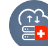

# Add-on SwissBackup 

A dedicated solution for all of your Jelastic nodes allowing the simple configuration of backup plans for
each of your containers. Using the reliability of the infrastructures dedicated to SwissBackup, all your data is
encrypted (end-to-end) and replicated 3 times in 3 differents geographic locations. You can easily restore a backup
on any node in your account.
## Backup Process

There are 2 types of backups possible.

### Back-up specific folders

When you select "Back-up specifics folders "the "Folders to back-up" field appears. This allows the specification
of the folders to save, you can specify several folders (separate each path with a ","). You must enter the absolute path of each folder that you want to save.

Example : /root/admin/, /home/user1/, /jelastic/containers/

In this example 3 folders have been specified.

After specifying these folders, you must select a backup plan.

### Snapshot of the whole container

When you select "Snapshot of the whole container" the "Backup all file system" field appears.
This allows you to save the entire file system of your container.

### Backup policies

2 backup plans are available:

    - Daily 
    
    - Hourly
    
Daily provides a backup of your files once a day at 11:00 p.m.

The associated retention policy is as follows : It will keep the most recent 7 daily snapshots, then 3  last-day-of-the-weeks and 6 last-day-of-the-months. And finally 3 last-day-of-the-year snapshots. This policy is applied every day at 11:00 p.m. on the target container.

Hourly provides a backup of your files every hour (at the start of the hour at 1:00 p.m. for example)

The associated retention policy is as follows : It will keep the most recent 24 hourly snapshots, the most recent 7 daily snapshots, then 3  last-day-of-the-weeks and 6 last-day-of-the-months. And finally 3 last-day-of-the-year snapshots.
This policy is applied every hour on the target container.

## Restoration Process

When selecting "Restore your data" these fields appear.

In the same way as for backups, you must specify your SwissBackup ID and password
associated.

The drop-down list displays the containers in which backups are present.
You just have to choose the container for which you want to restore the data.

After selecting the container, the corresponding backup plan appears.

Just select the ID of the backup you want to restore, the directory where you want
restore the backup and choose in which environment you want to restore your data.
