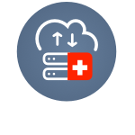

# Add-on SwissBackup 

Une solution dédiée pour l'ensemble de vos noeuds Jelastic permettant la configuration simple de plan de sauvegardes pour
chacuns de vos containers. Utilisant la fiabilité des infrastructures dédiées à SwissBackup l'ensemble de vos données sont
chiffrées end-to-end et répliquées 3 fois sur 3 lieux géographiques différents. Vous pouvez aisément restauré une sauvegarde
sur n'importe quel noeud de votre compte.

## Backup Process

Il y a 2 types de sauvegardes possbiles.

### Back-up specific folders

Quand vous sélectionnez Back-up specifics folders le champ Folders to back-up apparait.Celui-ci permet la spécification
des dossiers à sauvegarder, vous pouvez specifier plusieurs dossiers ( séparer chaques chemins par une "," ). Il faut renseigner le chemin absoliue de chaques dossiers que l'on désire sauvegarder.

Exemple : /root/admin/, /home/user1/, /jelastic/containers/

Dans cet exemple 3 dossiers ont été spécifié.

Après avoir spécifié ces dossiers il faut sélectionner un plan de sauvegarde. 

2 plans de sauvegardes sont proposés:

    - Daily 
    
    - Hourly
    
Daily assure une sauvegarde de vos dossiers 1 fois par jour à 23h00. 

La politique de rétenttion associée est la suivante : It will keep the most recent 7 daily snapshots, then 3 (remember, 7 dailies already include a week!) last-day-of-the-weeks and 6 last-day-of-the-months. And finally 3 last-day-of-the-year snapshots. Cette politique est appliqué tout les jours à 23h00 sur le container cible.

Hourly assure une sauvegarde de vos dossiers toutes les heures ( en début d'heure 13h00 par exemple ) 

La politique de rétention associée est la suivante : It will keep the most recent 24 hourly snapshots, the most recent 7 daily snapshots, then 3  last-day-of-the-weeks and 6 last-day-of-the-months. And finally 3 last-day-of-the-year snapshots. Cette politique est appliqué toutes les heures sur le container cible.

### Snapshot of the whole container

Quand vous sélectionnez Snapshot of the whole container le champ Backup all file system apparait.
Celui-ci permet de sauvegarder l'intégralité du système de fichiers de votre container.

## Restoration Process

Lors de la sélection de Restore your data ces champs apparaissent.

De la même manière que pour les sauvegardes il faut spécifier votre identifiant SwissBackup ainsi que le mot de passe
associé.

La liste déroulante affiche les containers dans lesquels des sauvegardes sont présentes.
Il vous suffit de choisir le container pour lequel vous voulez restaurer les données.

Après la sélection du container le backup plan correspondant apparait.

Il vous suffit de sélectionner l'ID du backup que vous voulez restaurez, le répertoire dans lequel vous voulez
restuarer le backup et de choisir dans quel environnement vous voulez restuarer vos données.
