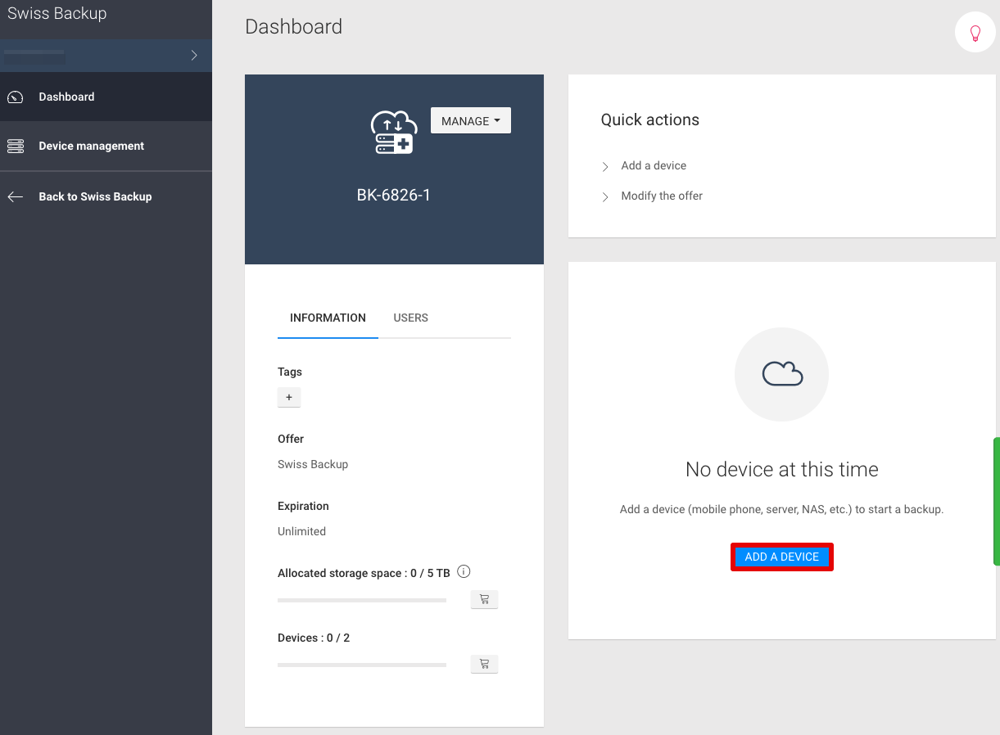

<p align="left">

</p>

# Add-on Swiss Backup 

A dedicated solution for all of your Jelastic nodes allowing the simple configuration of backup plans for
each of your containers. Using the reliability of the infrastructures dedicated to Swiss Backup, all your data is
encrypted (end-to-end) and replicated 3 times in 3 different geographic locations. You can easily restore a backup
on any node in your account.

Add-on user manual:

[Infomaniak's FAQ](https://faq.infomaniak.com/2420){target="_blank"}

You have 90 free days of Swiss Backup product. You can easily create your account in the Infomaniak manager.

First step:

<p align="left">

</p>

Choose Free storage space:

<p align="left">

</p>

You can see your Swiss Backup credentials here and in your email:

<p align="left">

</p>


## Backup Process

There are 2 types of backups possible.

### Back-up specific folders


When you select "Back-up specific folders" the field "Folders to back-up" appears. You can specify several folders (separate each path with a ","). You must enter the absolute path of each folder that you want to save.

Example : /root/admin/, /home/user1/, /jelastic/containers/

In this example 3 folders have been specified.

After specifying these folders, you must select a backup frequency.


### Snapshot of the whole container


When you select "Snapshot of the whole container", the field "Backup all file system" appears.
This allows you to save the entire file system of your container.
Please note that some files are excluded: /dev, /proc, /sys, /run
Any filesystem which isn’t specifically mounted as part of the root partition will be excluded, including virtual file systems.

### Backup frequency

2 backup frequencies are available:

    - Daily 
    
    - Hourly
    
Daily provides a backup of your files once a day at 08:00 p.m.

Hourly provides a backup of your files every hour (at the start of the hour at 1:00 p.m. for example)

### Backup retention

You can define how long to keep your backups (in years, months, days and hours).
If you want to keep your backups forever set the parameters to 0
Example:
If you backup every hour and you define a retention policy to 1 year, 2 months, 4 days, 2 hours, then every backup performed will be available for this defined period ( =10322 backups)
Note that the retention policy (deletion of the backups) is done all days at 10:30PM (UTC)

Example:

You back up your filesystem with the Hourly backup policy and you choose 1 year, 2 months, 4 days, 2 hours.
This means that every single backup will be available over a period of 1 year, 2 months, 4 days, 2 hours.

### Requirement 

You need to have at least one container lit with the add-on installed to see all your backups

## Restoration Process


When selecting "Restore your data" these fields will appear.

<p align="left">

</p>

In the same way as for backups, you must specify your Swiss Backup username and password.

The drop-down list displays the containers in which associated backups are present.
Select the container for which you want to restore the data.

<p align="left">

</p>

After selecting the container, the corresponding backup plan appears.

<p align="left">

</p>

Just select the backup you want to restore, the directory where you want restore the backup and choose in which environment you want to restore your data.

## Backups modification 

If you want to modify the configuration of your backups, simply restart the add-on from the marketplace. The automation of the backups will be updated.

## Delete backups directly in your nodes (CLI)

First step : ``` . /home/.config/swissbackup/openrc.sh ```

Second step: ``` restic snapshots (see all your backups) ```

Third step: to delete one backup : ```restic forget IdBackup --prune ```

To delete all backups of one file except one (security feature): ```restic forget --tag folders --keep-last 1 --prune```

<p align="left">

</p>

